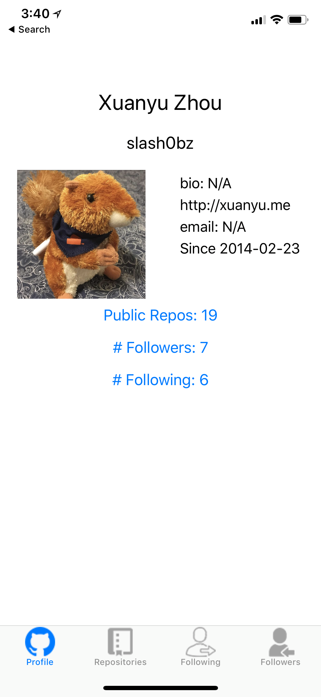
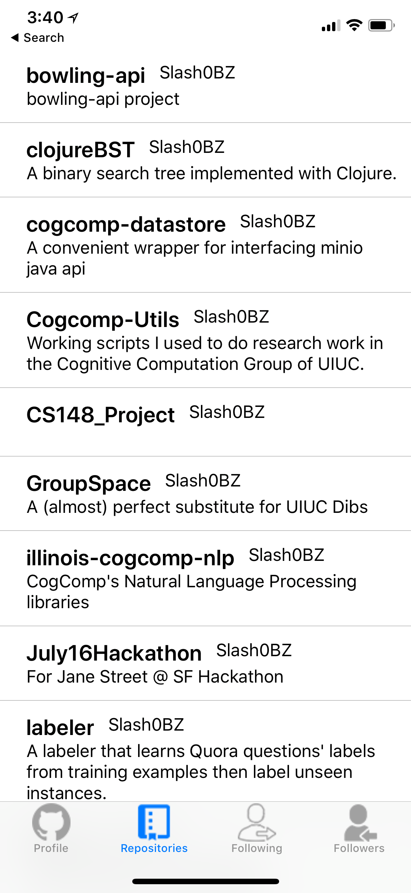
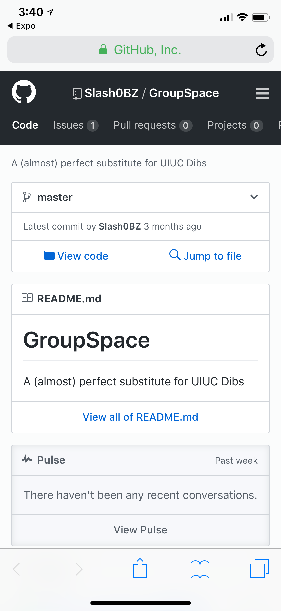
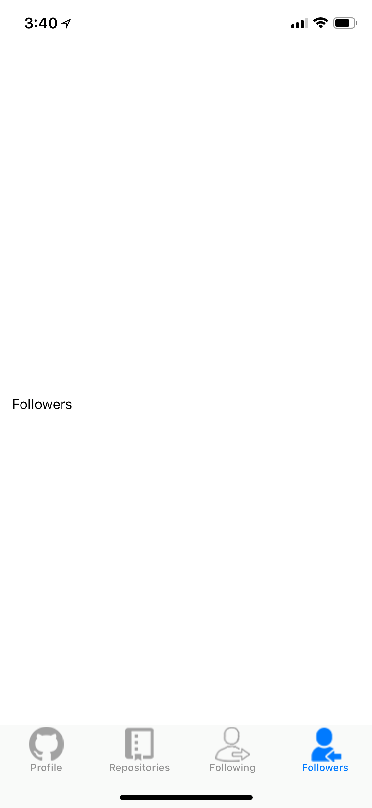
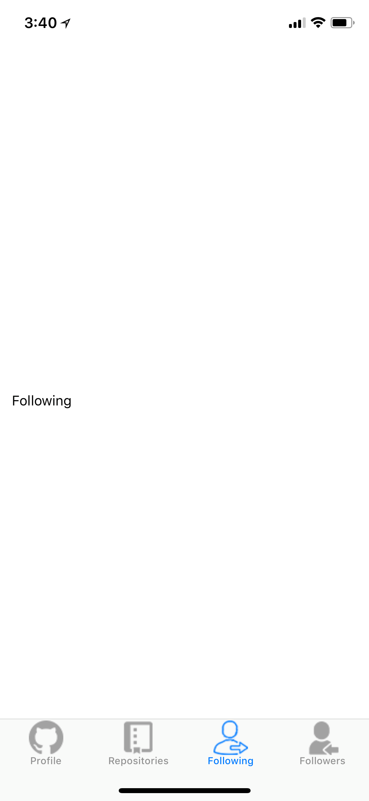
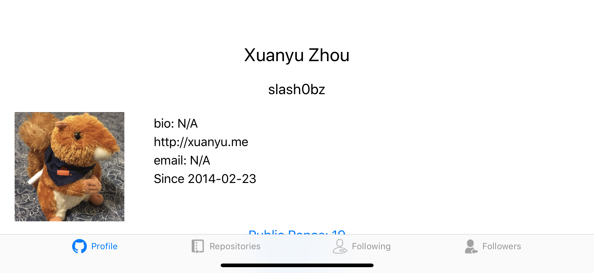
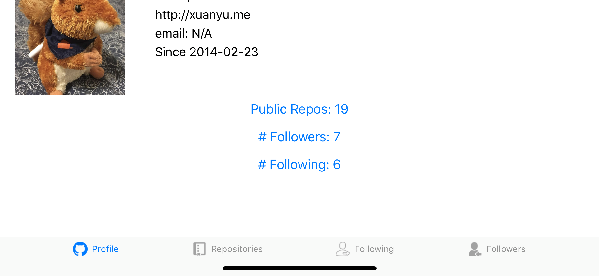

## Manul Test Plan

### Step 1

Open the app on Expo preview, and an app is loaded without crashing.

### Step 2

The page you should see is described in this figure:

## Step 3

Click on the repo tab, you should be directed:

## Step 4

Click on any repositories should open the repo page in native browser:

## Step 5

Back to step 2, the three buttons should work. For example, click on Followers should redirect to followers tab:

## Step 6

Similarly, click on Followers should redirect to followers tab:

## Step 7

Changing oritentation to horizontal should work, and the page should be scollable to fit all content

